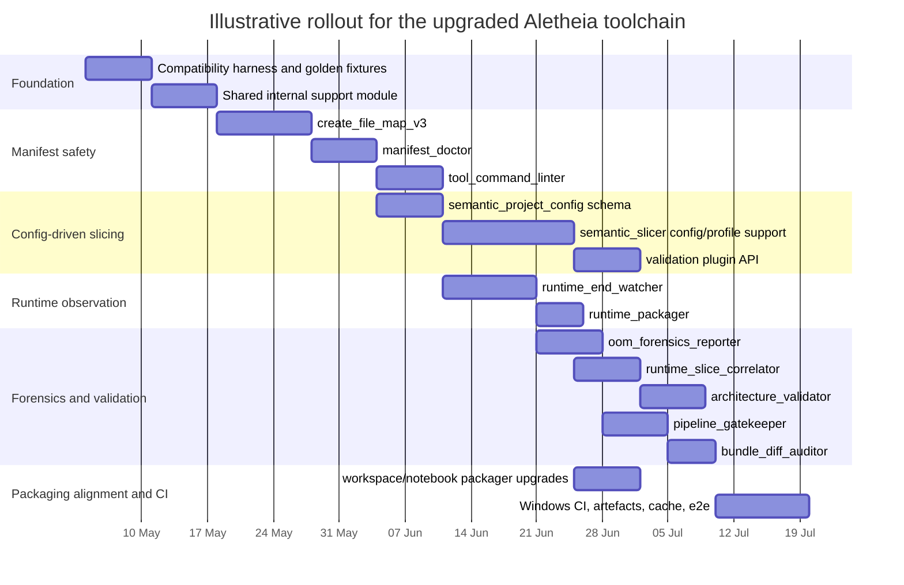

# Aletheia orchestration toolchain upgrade report

## Executive summary

The current Aletheia toolchain is already strong on **static code intelligence**. The agnostic Semantic Slicer guide positions the v6 line as a zero-dependency “semantic compiler” rather than a flat packager, with support for manifest-based scans, Git-diff scans, focus/depth traversal, deterministic hashing, JSON or text output, risk-weighted patch maps, heatmap diagnostics, explain mode, and an explicit “Layer X” uncertainty boundary. The workspace and notebook packagers already bring safe traversal, redaction, and portable hand-off formats, while `create_file_map_v2.py` already emits a usable manifest with `root`, `rel_path`, `abs_path`, `ext`, `size`, `mtime_iso`, and optional `sha1`. fileciteturn0file0 fileciteturn0file1 fileciteturn0file2 fileciteturn0file3 fileciteturn0file4

The main weakness is **not** the extraction engine itself; it is the missing control plane around it. The transcripts show repeated failures that were operational rather than analytical: `No valid files found`, command-line drift around `-o` versus `--out`, 110,235-file and 118,134-file scans caused by broad `.` scans or by combining `.` with `--manifest`, and polluted manifests caused by virtual environments, generated bundles, cloned repositories, and failed workspaces. The same transcript also records that a cleaned manifest reduced one extraction from roughly 2.5 million tokens to about 130k, which is exactly the kind of improvement a proper validation and gatekeeping layer should make routine rather than manual. fileciteturn0file7

The recommended upgrade path is therefore **additive, not disruptive**: keep the current tools and CLI behaviours available, but add a configuration plane, a validation plane, and a runtime-evidence plane around them. In practical terms, that means: a project configuration contract for config-driven slicing; a `manifest_doctor` and `tool_command_linter` to prevent bad runs before they start; a `runtime_end_watcher` plus post-run forensic tools to capture memory, crash, stdout/stderr, and artefact growth after a process exits; a generic `architecture_validator` and `pipeline_gatekeeper` to automate rule checking; and a plugin API so that the specialised behaviour that existed in v5.2 can be reintroduced cleanly per project rather than hard-coded into the slicer core. fileciteturn0file5 fileciteturn0file0 fileciteturn0file1

The most important architectural decision is this: **treat project expectations as data, not as agent memory and not as ad hoc code branches**. v5.2 proves the value of domain-aware interpretation because it hard-coded a numerical simulation / mathematical validation worldview into the slicer via scientific system purpose, operator classifications, geometry mapping, and GPU profiles; v6.0 proves the value of reverting to an agnostic default. The right next step is to preserve the agnostic core while moving domain-specific expectations into `semantic_project_config` files and validator plugins. fileciteturn0file5 fileciteturn0file0

The roadmap below assumes that **team size is unspecified**. Effort is therefore expressed as **Low / Medium / High** and the Gantt chart is illustrative rather than contractual. A workable assumption is one maintainer plus one reviewer; if the work is solo, the elapsed calendar time should be treated as a range and roughly doubled for planning purposes.

## Current toolchain baseline

The current stack has four valuable properties that should be preserved. First, it is largely **standard-library-first**: the Semantic Slicer guide explicitly describes the slicer as zero-dependency and requiring Python 3.10+, which is important for air-gapped and CI uses. Second, it already produces **stable machine-readable intelligence** through deterministic hashing, structural slice identities, patch-safety maps, and JSON output for automated pipelines. Third, it already has a **security kernel** pattern—sensitive-pattern redaction and entropy-based redaction appear in the slicer, workspace packager, and notebook packager. Fourth, it already supports **human-facing and machine-facing** outputs, which should remain true after the upgrade. fileciteturn0file1 fileciteturn0file0 fileciteturn0file2 fileciteturn0file4

There are also clear differences between the generations of the slicer that matter for design. The v5.2 code is explicitly specialised for a nonlinear field / spectral-locking research pipeline, including a scientific system purpose, operator typing such as “spectral differential operator” and “geometry mapping”, and GPU profiles. The v6.0 code resets those defaults to “General software system” and “Analyze and safely modify the codebase based on user instructions”, and the guide frames that version as domain-agnostic. That means the toolchain has already travelled from **hard-coded specialisation** to **agnostic core**; the next iteration should be **agnostic core plus external profiles/plugins**, not a return to hard-coded project branches. fileciteturn0file5 fileciteturn0file0

`create_file_map_v2.py` is already a good foundation for manifest-driven workflows because it defaults to scanning the current directory, writes CSV output, supports extension filtering, supports excluded directories, and can compute SHA-1 hashes for files up to 50 MB. The critical weakness is operational clarity: in the transcript, using `-o` instead of `--out` caused the map creation step to fail, which then cascaded into later slicer failures because the manifest file did not exist. This is exactly the kind of error that should be intercepted by a command linter and a manifest doctor before the user burns time on a broken workflow. fileciteturn0file3 fileciteturn0file7

The transcript also shows that the present tooling depends too much on agents remembering hidden rules. Using `.` for a broad scan caused a 110,235-file run; later, passing `.` alongside `--manifest` caused another 118,134-file run because the slicer effectively merged both sources of targets; and polluted manifests pulled in virtual environments and failed workspaces until the exclude list was repeatedly repaired. Those are strong signals that the toolchain now needs **machine-enforced preflight validation** rather than more elaborate conversational instructions. fileciteturn0file7

That logic extends to runtime evidence. The current tools are very good at telling an agent how a codebase is structured, but they do not yet package the runtime facts that matter for OOM, timeout, or crash analysis. Python’s `tracemalloc` can capture allocation snapshots and diff them, `faulthandler` can dump tracebacks on crashes or timeouts, PowerShell’s `Get-Process` exposes process metrics including working set in bytes, and `Get-Counter` can sample performance counters at intervals on Windows. Those capabilities line up closely with your requirement for a lightweight watcher that waits until the programme ends and then compiles a report. citeturn4view6turn4view7turn4view5turn4view4

## Prioritised implementation roadmap

The safest path is to build from the outside in: first prevent obviously bad commands and polluted manifests, then add project-aware configuration, then add runtime evidence capture, then build correlation and gatekeeping on top. That order matches the transcripts: most wasted time happened **before** the slicer produced useful output, not after. fileciteturn0file7

**Effort scale used below:** **Low** means roughly 2–4 developer days; **Medium** means roughly 1–2 weeks; **High** means roughly 2–4 weeks. These are indicative ranges only because team size and review bandwidth are currently unspecified.

| Milestone | Scope | Effort | Depends on | Main risk | Risk mitigation |
|---|---|---:|---|---|---|
| Foundation hardening | Create transcript regression fixtures, define common support module, lock CLI compatibility rules | Medium | None | Regressing existing commands | Golden-command regression tests; keep old flags and outputs working by default |
| Manifest safety layer | Build `create_file_map_v3`, `manifest_doctor`, and `tool_command_linter` | Medium | Foundation hardening | Over-correcting and blocking valid edge cases | Start in “warn then fail” mode; ship transcript-derived regression cases |
| Config-driven slicing | Add `semantic_project_config`, `--config`, `--task-profile`, validator hooks, and profile-aware exclusion logic to the slicer | High | Manifest safety layer | Re-introducing domain coupling into the core | Keep config external; CLI overrides config; no hard-coded project rules in core |
| Runtime observation layer | Build `runtime_end_watcher` and `runtime_packager` | Medium | Foundation hardening | Monitoring itself causing overhead | Default to low-frequency sampling and post-exit compilation; stream logs to files, not memory |
| Forensic correlation layer | Build `oom_forensics_reporter`, `runtime_slice_correlator`, and `architecture_validator` | High | Config-driven slicing, runtime observation layer | False certainty about root cause | Report confidence levels and uncertainty classes; never claim proof from static patterns alone |
| Gatekeeping layer | Build `pipeline_gatekeeper` and `bundle_diff_auditor`; wire to OIR/TAER flows | Medium | Manifest safety layer, forensic correlation layer | Gates becoming too rigid for mixed workflows | Allow profile-specific thresholds and “warn / block / override” levels |
| Packaging alignment | Add manifest/config awareness to `workspace_packager` and `notebook_packager` | Low–Medium | Config-driven slicing | Behaviour drift across tools | Move shared parsing/redaction/report code into a single internal core module |
| CI and E2E stabilisation | Windows CI, integration fixtures, runtime crash fixtures, artefact upload, cache strategy | Medium | All previous milestones | Flaky runtime tests | Separate deterministic unit tests from best-effort runtime integration tests |



The comparison below separates **upgraded tools** from **new tools**, and keeps each row aligned to the actual toolchain paths and interfaces you already use.

| Tool | Status | Purpose | Primary inputs | Primary outputs | Key CLI flags | Integration points |
|---|---|---|---|---|---|---|
| `D:\Aletheia_project\DEV_TOOLS\semantic_slicer_v6.0.py` → `semantic_slicer_v7.0.py` | Upgrade | Keep all existing slicing features; add config-driven profiles, validator hooks, safer manifest semantics, runtime-aware hints | Paths, manifest, Git diff, config, task profile | Text/JSON intelligence bundle, heatmap, explain output | Existing flags plus `--config`, `--task-profile`, `--validate-only`, `--allow-path-merge-with-manifest` | Tool Assist extraction, architecture validation, runtime correlation |
| `D:\Aletheia_project\DEV_TOOLS\create_file_map_v2.py` → `create_file_map_v3.py` | Upgrade | Preserve CSV manifest generation; add health report, profiles, optional `-o` alias, pollution fail-fast | Roots, include/exclude rules, config | CSV manifest, JSON health report | Existing flags plus `--profile`, `--health-report`, `--fail-on-pollution`, `--max-file-size`, `-o` alias | Tool Assist preflight, manifest doctor, bundle freshness checks |
| `D:\Aletheia_project\DEV_TOOLS\workspace_packager_v2.3.py` → `workspace_packager_v2.4.py` | Upgrade | Preserve mixed-language packaging; add manifest/config awareness and staged packaging | Path or manifest, config | Text/JSON/XML workspace bundle | Existing flags plus `--manifest`, `--config`, `--staging-dir` | Fallback when slicer is insufficient; runtime evidence packaging |
| `D:\Aletheia_project\DEV_TOOLS\notebook_packager.py` → `notebook_packager_v3.1.py` | Upgrade | Preserve self-extracting notebook bundle; add manifest/config/staging awareness | Path or manifest, config | `.ipynb` bundle | Existing flags plus `--manifest`, `--config`, `--staging-dir`, `--requirements-mode` | Portable hand-off, Colab reproduction, evidence sharing |
| `manifest_doctor.py` | New | Validate manifest size, cleanliness, required coverage, and stale rows before slicing | CSV manifest, config | JSON/Markdown manifest health report | `--manifest`, `--config`, `--required-path`, `--fail-thresholds`, `--out` | Tool Assist preflight, gatekeeper |
| `runtime_end_watcher.py` | New | Launch a target, sample runtime signals lightly, and compile evidence after the process exits | Command, sampling options, config | Metrics JSON, log tails, artefact growth, summary report | `--cmd`, `--sample-seconds`, `--metrics-mode`, `--timeout`, `--out-dir`, `--python-faultevidence` | Training pipeline runs, backend runtime checks, OOM investigations |
| `oom_forensics_reporter.py` | New | Combine runtime evidence with static rules to rank likely memory causes and generate next-step extraction guidance | Runtime report, bundle/manifest, config | Markdown/JSON forensic report, suggested OIR | `--runtime-report`, `--bundle`, `--manifest`, `--config`, `--out` | Post-run diagnosis, builder planning |
| `runtime_slice_correlator.py` | New | Map logs, stack traces, or runtime symptoms back to slice IDs and files | Runtime report, slicer JSON bundle | Correlation report, ranked slice list, explain commands | `--runtime-report`, `--bundle-json`, `--out` | Review, explain-mode follow-up |
| `architecture_validator.py` | New | Evaluate a bundle against project contracts and performance/memory rules | Bundle JSON, config, plugin hooks | PASS/WARN/FAIL report | `--bundle`, `--config`, `--plugin`, `--out` | Tool Assist review, gatekeeper, AAO/TDQO analysis |
| `tool_command_linter.py` | New | Lint and optionally rewrite unsafe PowerShell commands before execution | PowerShell command block, config, tool registry | JSON lint report, fixed suggestions | `--command-file`, `--command`, `--config`, `--rewrite`, `--out` | Tool Assist TAER flow, user safety |
| `pipeline_gatekeeper.py` | New | Turn multiple reports into machine-checkable stop/go decisions | Manifest doctor report, validator report, runtime report, thresholds | Gate decision JSON and Markdown summary | `--manifest-report`, `--validator-report`, `--runtime-report`, `--policy`, `--out` | OIR/TAER enforcement, orchestration phase gating |
| `bundle_diff_auditor.py` | New | Decide whether an existing bundle is current, stale, or missing changed files | Old bundle, current manifest, optional new bundle | Staleness report | `--old-bundle`, `--current-manifest`, `--new-bundle`, `--out` | Verification loops, reuse of prior extracts |
| `runtime_packager.py` | New | Package runtime evidence safely for agents and CI | Runtime watcher directory, config | Markdown/JSON evidence bundle | `--runtime-dir`, `--config`, `--out` | Incident hand-off, CI artefacts |
| `validation plugin API` | New module/API | Allow project-specific checks without forking slicer core | Bundle, manifest, runtime evidence, config | Plugin findings merged into reports | No user CLI; discovered via local plugin dir and optionally entry points | semantic_slicer, architecture_validator, gatekeeper |

## Detailed design specifications

A strong implementation pattern for all of the new work is to create a small, internal, non-user-facing core module—something like `aletheia_tool_core`—and move into it the common code that is currently duplicated across the slicer and both packagers: redaction/security kernel logic, ignore-list handling, config loading, report writing, shared PowerShell-friendly output writers, and manifest parsing. The code snippets show that the existing tools already duplicate sensitive-pattern redaction, entropy handling, and ignore-directory logic, so a shared core will reduce drift and make later policy changes consistent. fileciteturn0file0 fileciteturn0file2 fileciteturn0file4

**`semantic_project_config`** should be the canonical project contract. The design recommendation is: document it in YAML-like schema form for humans, but make the first implementation accept **JSON as the mandatory format** and **TOML as an optional format when a 3.11+ interpreter is guaranteed**; `tomllib` only enters the standard library in Python 3.11, while the current slicer guide still targets Python 3.10+, so making TOML mandatory would raise the runtime floor unless you add a dependency. YAML support can be an optional extra rather than a baseline requirement if preserving the zero-dependency posture matters. fileciteturn0file1 citeturn4view9

A practical schema should contain `schema_version`, `project_identity`, `source_scope`, `profiles`, `architecture_expectations`, `risk_rules`, `runtime_dynamics`, `gates`, and `plugins`. `profiles` should be the important part: each profile should declare default include/exclude rules, required languages, likely focus symbols or focus terms, whether heatmap is required, expected runtime hazards, and validation rules. A `runtime_memory_audit` profile, for example, should be able to say “default to manifest mode, require heatmap, inspect list accumulation, full-document serialisation, NetworkX/PageRank, YAML loading loops, and incremental output semantics”. That keeps the agnostic slicer core intact while externalising the sort of domain logic that v5.2 hard-coded. fileciteturn0file5 fileciteturn0file1

A good PowerShell invocation pattern for the config-aware slicer would be:

```powershell
python "D:\Aletheia_project\DEV_TOOLS\semantic_slicer_v7.0.py" `
    --config ".\semantic_project_config.json" `
    --task-profile "runtime_memory_audit" `
    --manifest ".\filtered_tool_assist_map.csv" `
    --format text `
    --deterministic `
    -o ".\runtime_memory_audit.yaml"
```

The precedence rule should be simple and testable: CLI flags override profile defaults, profile defaults override project-wide defaults, and project-wide defaults override built-in tool defaults. Failure modes should be explicit: invalid config schema, unknown profile, unsupported format, missing required path coverage, or incompatible profile/tool combinations. Unit tests should verify schema loading, precedence, profile inheritance, and deterministic resolution snapshots.

**`manifest_doctor.py`** should become the mandatory preflight for large or mixed projects. It should ingest the CSV emitted by `create_file_map_v2.py`/`v3`, verify that `abs_path` exists for every row because the current slicer transcript explicitly relies on the `abs_path` column for manifest-based slicing, and then score the manifest against profile rules: row count thresholds, excluded-directory leakage, stale rows, missing required directories, missing required extensions, oversize files, and suspicious generated artefacts. The transcript is unambiguous that manifest pollution was the root cause for several failures, not the slicer algorithm itself. fileciteturn0file3 fileciteturn0file7

A representative command shape would be:

```powershell
python "D:\Aletheia_project\DEV_TOOLS\manifest_doctor.py" `
    --manifest ".\filtered_tool_assist_map.csv" `
    --config ".\semantic_project_config.json" `
    --required-path "backend\python-daemon\orchestrator" `
    --required-path "backend\node-mcp\src" `
    --out ".\manifest_health_report.json"
```

The expected output should include a top-level `status` (`PASS`, `WARN`, `BLOCK`), row counts, suspicious-path counts, required-coverage checks, and a normalised “recommended next command” section. The most important tests are transcript regressions: the doctor must detect virtual environments, failed workspaces, generated bundle files, missing `.mjs` or other required languages when a profile requires them, and row sets that exceed the soft or hard thresholds.

**`runtime_end_watcher.py`** should be designed as a **post-exit compiler**, not a live debugger. That matches your requirement to avoid interfering with the monitored process and reduces the chance that the watcher itself worsens memory pressure. The safest base implementation is hybrid: launch and supervise the child process from Python with `subprocess.Popen`, pass arguments as a sequence rather than leaning on `shell=True`, stream stdout/stderr to files rather than buffering them into memory, sample coarse process metrics on Windows via `Get-Process` or `Get-Counter`, and optionally enable Python-only evidence modes such as `-X tracemalloc` or `-X faulthandler` when the target is a Python command and the user allows wrapping. The Python subprocess docs explicitly recommend argument sequences and warn that buffered pipe reads can deadlock or consume large memory for unbounded output; Microsoft’s PowerShell docs confirm that `Get-Process` and `Get-Counter` expose the process and performance information this design needs. citeturn6view0turn6view2turn4view5turn4view4

A recommended invocation pattern is:

```powershell
python "D:\Aletheia_project\DEV_TOOLS\runtime_end_watcher.py" `
    --name "dag_scoring_pass" `
    --cmd "python dag_scoring_pass.py" `
    --sample-seconds 5 `
    --metrics-mode "powershell" `
    --timeout 7200 `
    --out-dir ".\runtime_reports\dag_scoring_pass_20260504" `
    --python-faultevidence
```

Expected outputs should include `runtime_metrics.json`, `stdout_tail.txt`, `stderr_tail.txt`, `artifact_growth.json`, `timeline.csv`, and `runtime_summary.md`. If Python memory tracing is enabled, the tool should also emit `tracemalloc_top_allocators.json` and snapshot diffs, because `tracemalloc` can compare snapshots to detect memory growth by file and line number when tracing starts early enough. If fault handling is enabled, the tool should direct `faulthandler` output to a file that remains open for the life of the run, because that is how the module is designed to operate. citeturn4view6turn4view7

The failure modes here are important. If process creation fails, the watcher should still emit a report with `status=START_FAILED`. If the child never exits, the watcher should kill it, note timeout evidence, and package partial logs. If performance counters are unavailable, the watcher should degrade to a lighter mode and report that downgrade. If the target command spawns unrelated grandchildren that escape monitoring, the report should mark “partial process-tree visibility” rather than pretend completeness. Unit tests should cover each of those cases with synthetic commands; integration tests should include a memory spike, a controlled crash, a long-running command with growing output, and a process timeout.

**`oom_forensics_reporter.py`** should sit one step above the watcher. Its job is not to prove a root cause; its job is to rank likely causes, explain confidence, and produce the next best extraction request. It should ingest the watcher’s runtime summary, optionally a slicer bundle or manifest, and the project config. It should then combine runtime peaks, last successful output, stderr patterns, and config-defined static risks—such as list accumulation, whole-dataset `json.dump`, repeated `yaml.safe_load`, global NetworkX graph creation, or “late massive write” patterns—into a ranked report. This uses the exact pairing your transcripts repeatedly needed: runtime evidence plus a focused static slice. fileciteturn0file7 fileciteturn0file1

A representative command could be:

```powershell
python "D:\Aletheia_project\DEV_TOOLS\oom_forensics_reporter.py" `
    --runtime-report ".\runtime_reports\dag_scoring_pass_20260504\runtime_metrics.json" `
    --manifest ".\filtered_tool_assist_map.csv" `
    --config ".\semantic_project_config.json" `
    --out ".\oom_forensics_report.md"
```

The outputs should contain sections for runtime evidence, static risk correlation, probable cause, uncertainty notes, and a machine-generated OIR snippet for Tool Assist. The main failure mode is false confidence when memory was primarily consumed in native code or an external dependency that `tracemalloc` cannot see; the report should therefore use confidence tiers such as `LOW`, `MEDIUM`, and `HIGH`, and explicitly state whether the conclusion is based on Python allocations, OS working-set growth, or only static heuristics.

**`runtime_slice_correlator.py`** should connect a watcher report or traceback to slicer slice IDs. The right design is to consume slicer JSON output because the v6 guide explicitly says the JSON path exposes state mutation and patch target validation for automated pipelines, and the code itself maintains patch target validation and state mutation maps. That makes the correlator much more precise than string matching on filenames alone. fileciteturn0file1 fileciteturn0file0

A sample command:

```powershell
python "D:\Aletheia_project\DEV_TOOLS\runtime_slice_correlator.py" `
    --runtime-report ".\runtime_reports\dag_scoring_pass_20260504\runtime_summary.json" `
    --bundle-json ".\dag_scoring_bundle.json" `
    --out ".\runtime_slice_correlation.md"
```

The output should rank likely slices, list the relevant entry points and call paths, and include ready-made `--explain` commands for the top candidates. Failure modes include missing JSON bundle layers, dynamic behaviour beyond the slicer’s confidence boundary, or logs that mention process symptoms but no file/function clues. In those cases the tool should degrade gracefully to file-level or module-level hints and carry over the uncertainty.

**`architecture_validator.py`** is the mechanism that translates project expectation files into machine-checkable assessments. It should ingest a slicer bundle in JSON, apply profile rules, and emit a report with findings such as `PASS`, `WARN`, `FAIL`, severity bands, supporting slices, and next-step implications. This is the correct place to re-introduce domain-specific checking that used to live inside v5.2: instead of hard-coding simulation logic in the slicer core, implement those expectations as validators driven by config and plugins. That preserves the v6 goal of an agnostic semantic compiler while keeping the expressive power that made v5.2 useful for numerical simulation and mathematical validation. fileciteturn0file5 fileciteturn0file0

A command shape:

```powershell
python "D:\Aletheia_project\DEV_TOOLS\architecture_validator.py" `
    --bundle ".\current_backend_runtime_review.json" `
    --config ".\semantic_project_config.json" `
    --out ".\architecture_validation_report.md"
```

The validator should support rule categories such as required entry points, forbidden runtime behaviours, required output style (`jsonl_incremental`, for example), allowed storage modes, required contracts, and memory/performance rules. For SQLite-heavy runtime profiles, a plugin can check for busy-timeout handling and whether WAL-related assumptions are sensible; SQLite’s documentation explicitly notes both the existence of a busy timeout mechanism and the concurrency/ checkpointing trade-offs of WAL mode. citeturn4view11turn5view0turn4view10

**`tool_command_linter.py`** should be treated as a first-class safety tool, because the transcript evidence is so strong. It should parse PowerShell command blocks, recognise the relevant Aletheia tool CLIs, and then fire rules such as: invalid flag for tool version (`-o` against `create_file_map_v2.py`), positional `.` plus `--manifest` without an explicit merge flag, missing manifest validation step for a large workspace, missing exclusion lists for known pollution patterns, writing outputs into directories that are likely to be re-scanned, or missing `--deterministic` in automated flows. The transcript gives several ready-made regression rules. fileciteturn0file3 fileciteturn0file7

A command pattern:

```powershell
python "D:\Aletheia_project\DEV_TOOLS\tool_command_linter.py" `
    --command-file ".\proposed_commands.ps1" `
    --config ".\semantic_project_config.json" `
    --out ".\command_lint_report.json"
```

Outputs should include `status`, `errors`, `warnings`, `autofixes`, and a clean “safe to run” boolean. The best extra feature is `--rewrite`, which can emit a corrected command block for common mistakes while still recording that a rewrite occurred. Tests should include every known transcript failure and a growing set of “golden command” fixtures for the supported tools.

**`pipeline_gatekeeper.py`** should be a composition engine rather than a parser. It should ingest the reports from `manifest_doctor`, `architecture_validator`, `runtime_end_watcher`, `oom_forensics_reporter`, and `bundle_diff_auditor`, then apply a policy from either the project config or a dedicated gate policy. The output should be a simple machine-readable gate verdict plus a short Markdown summary for humans. This is the tool that turns “good extraction hygiene” into a formal orchestration step. fileciteturn0file1

A command shape:

```powershell
python "D:\Aletheia_project\DEV_TOOLS\pipeline_gatekeeper.py" `
    --manifest-report ".\manifest_health_report.json" `
    --validator-report ".\architecture_validation_report.json" `
    --runtime-report ".\runtime_reports\dag_scoring_pass_20260504\runtime_metrics.json" `
    --policy ".\gate_policy.json" `
    --out ".\gatekeeper_report.json"
```

The internal policy model should support `required`, `warn`, and `overrideable` gates. That lets one project block on polluted manifests but only warn on missing heatmap evidence, while another can hard-block on `branch_quality_summary.json` or peak memory above a threshold. Tests should check missing input reports, conflicting gate states, threshold overrides, and deterministic policy resolution.

**`create_file_map_v3.py`** should be a strict superset of v2, not a rewrite that forces migration pain. The safest design is to preserve the current CSV field names and behaviours, but add profiles, health-report generation, a pollution score, configurable size caps, and a deprecated `-o` alias that still normalises to the canonical `--out`. The transcript shows that `-o` is a real operational foot-gun in v2; adding a compatibility alias in v3 is therefore a pragmatic improvement so long as the linter still teaches users and agents to prefer `--out` as the canonical form. fileciteturn0file3 fileciteturn0file7

A practical command shape:

```powershell
python "D:\Aletheia_project\DEV_TOOLS\create_file_map_v3.py" `
    --roots "." `
    --profile "python_runtime_audit" `
    --include-exts ".py,.mjs,.json,.toml" `
    --exclude-dirs "output,runs,.venv,__pycache__,node_modules,.git,failed_workspaces" `
    --health-report ".\filtered_map_health.json" `
    --out ".\filtered_tool_assist_map.csv"
```

Expected outputs are the same CSV schema as v2 plus an optional JSON health report. Failure modes should include unreadable roots, manifest explosion, oversize rows, and unsafe overlaps between source roots and output locations. Tests should verify backward compatibility with v2-style downstream consumers, especially anything that expects `abs_path`.

**`bundle_diff_auditor.py`** should reuse the deterministic bundle philosophy already present in the slicer generation. The v6 and v5.2 lines both emphasise reproducible bundle hashes and file-identifying fingerprints, so a staleness auditor can work by comparing an old bundle’s declared inputs and fingerprints against a fresh manifest or a new bundle. That is particularly useful for verification loops where an orchestrator wants to know whether it can reuse an earlier slice safely. fileciteturn0file5 fileciteturn0file1

A command shape:

```powershell
python "D:\Aletheia_project\DEV_TOOLS\bundle_diff_auditor.py" `
    --old-bundle ".\previous_backend_review.yaml" `
    --current-manifest ".\filtered_tool_assist_map.csv" `
    --out ".\bundle_staleness_report.md"
```

The output should classify the bundle as `CURRENT`, `STALE`, or `INCOMPLETE`, and list changed, new, and missing files. Core tests should cover same-manifest same-hash, changed source same profile, deleted file, and “bundle missing fingerprint metadata”.

**`runtime_packager.py`** should be the runtime equivalent of `workspace_packager.py`: a safe, redacted bundler for logs, metrics, summaries, and small supporting artefacts. It should reuse the same security-kernel style redaction already present in the existing packagers, because runtime logs are more likely than source files to contain tokens, connection strings, or user data. That security pattern is already established in the current tools. fileciteturn0file2 fileciteturn0file4

A command shape:

```powershell
python "D:\Aletheia_project\DEV_TOOLS\runtime_packager.py" `
    --runtime-dir ".\runtime_reports\dag_scoring_pass_20260504" `
    --config ".\semantic_project_config.json" `
    --out ".\dag_scoring_runtime_evidence.json"
```

Outputs should include a concise Markdown report and a structured JSON bundle. Tests should focus on redaction, oversize truncation, missing files, and stable package hashes.

**The validation plugin API** should support both a local plugin folder and optional package discovery through Python entry points. The packaging ecosystem already standardises entry points through the PyPA specification, and Python can read those entry points via `importlib.metadata`, which makes the approach portable and future-proof if you later want installable validator packs. citeturn4view3turn4view8

A light but useful interface would expose hooks such as `augment_manifest`, `inspect_bundle`, `inspect_runtime`, `contribute_gate_rules`, and `render_hints`. Plugin exceptions must never crash the core tools; they should be caught, logged, and surfaced as structured plugin failures in the relevant report. Tests should cover discovery, hook ordering, plugin isolation, and mixed local-plus-entry-point loading.

Finally, **`workspace_packager_v2.4.py`** and **`notebook_packager_v3.1.py`** should be given a smaller compatibility upgrade: both should accept `--manifest` and `--config`, both should be able to honour staged subsets selected by `manifest_doctor`, and the notebook packager should add `--requirements-mode auto|off|required` plus `--staging-dir` so that portable reproduction does not accidentally include huge generated artefacts. Those improvements fit naturally with the tools’ existing safe traversal, redaction, multi-format output, and size-limit behaviour. fileciteturn0file2 fileciteturn0file4

## Integration plan for agents

The upgraded toolset should not collapse the current agent boundaries; it should make those boundaries easier to operate. The Tool Assist Agent remains the tool-aware intermediary. The Agentic Agent Orchestrator remains the plan/refinement/review agent for the orchestration stack. The Training / Fine-tune Orchestrator remains the project-specific orchestrator for training data, scoring, formatting, and finetuning work. The upgrade is that all three agents now gain **machine-checkable preflight artefacts** instead of relying on conversational memory.

For **Tool Assist**, the recommended flow is: receive an OIR; load or request `semantic_project_config`; run or request `create_file_map_v3`; run `manifest_doctor`; lint the planned command block with `tool_command_linter`; if the request concerns a long-running job or a post-mortem, require `runtime_end_watcher` or an existing runtime evidence bundle; only then emit the slicer or packager command. During review, Tool Assist should run `architecture_validator`, optionally `runtime_slice_correlator`, and finally `pipeline_gatekeeper` before generating the downstream-safe handover. This preserves the current TAER idea, but turns the most important decisions into files and reports rather than prose-only judgement. The transcript failures around file-map creation, polluted manifests, and unsafe `.` scans are the direct justification for this ordering. fileciteturn0file7

A proposed OIR extension for Tool Assist looks like this:

```yaml
schema_version: "OIR/v1.3"

project_context:
  project_root: "C:\\Users\\jakem\\Documents\\New project"
  known_project_state: "stale"
  cloud_agent_has_files: false

teleology_and_intent:
  primary_goal: "Verify current runtime implementation and surface integration risks."
  investigation_type: "architecture_handoff"
  reasoning_context: "Recent backend changes need polyglot verification and runtime-hardening review."
  downstream_decision_needed: "Approve current implementation or order a hardening patch."

config_hints:
  semantic_project_config_path: ".\\semantic_project_config.json"
  task_profile: "polyglot_runtime_review"
  require_manifest_doctor: true
  require_command_linter: true
  require_gatekeeper: true

advanced_feature_preferences:
  semantic_slicer:
    consider_manifest_mode: true
    consider_heatmap: true
    consider_explain: true
  runtime_tools:
    consider_runtime_end_watcher: true
    consider_runtime_slice_correlator: true
```

A matching TAER fragment should make the new control plane explicit:

```yaml
schema_version: "TAER/v1.4"

response_state:
  status: "READY_TO_SLICE"
  may_proceed_to_slicing: true
  reason: "Manifest is clean; command block passed lint; profile requires heatmap."

capability_decision_ledger:
  - tool: "create_file_map_v3"
    feature: "profile"
    decision: "USE"
    reason: "Project config defines polyglot include set and excludes generated artefacts."
  - tool: "manifest_doctor"
    feature: "pollution_gate"
    decision: "USE"
    reason: "Prior project state is stale and bundle pollution is a known risk."
  - tool: "tool_command_linter"
    feature: "manifest_plus_paths_rule"
    decision: "USE"
    reason: "Prevent accidental '.' + --manifest broad scans."
  - tool: "semantic_slicer_v7"
    feature: "manifest_mode"
    decision: "USE"
    reason: "Clean manifest exists and heatmap is required by profile."
  - tool: "pipeline_gatekeeper"
    feature: "pre_handover_gate"
    decision: "USE"
    reason: "Downstream handover must only be issued after validation passes."
```

For the **Agentic Agent Orchestrator**, the new tools mainly improve phase transitions. In the investigation phase, AAO should now ask Tool Assist for a config-aware OIR rather than only a slice request. In the analysis phase, AAO should consume not just the bundle or handover note, but also `manifest_doctor` status and—where relevant—`architecture_validator` or `bundle_diff_auditor` results. In the verification phase, AAO should request a post-implementation OIR that includes both the updated slice and a staleness decision from `bundle_diff_auditor`, because that lets it distinguish “builder changed target code” from “review bundle is stale”. This makes AAO more reliable without forcing it to become tool-aware itself.

For the **Training / Fine-tune Orchestrator**, the biggest change is the runtime path. Long-running, memory-sensitive stages such as DAG scoring, corpus formatting, amplification, or audit passes should be run under `runtime_end_watcher` when the team is explicitly investigating reliability, throughput, or OOM. The orchestrator should then request Tool Assist to correlate the watcher’s runtime outputs with a profile-aware slice through `oom_forensics_reporter` and `runtime_slice_correlator`. That turns “the machine crashed” into a testable chain: runtime evidence → static correlation → focussed builder prompt → post-patch verification. The transcript’s OOM and broad-scan failures are the precedent for making this the default pattern for performance audits. fileciteturn0file7

The preflight checks should therefore be standardised across agents. At minimum they should include: tool presence (`Test-Path` for the toolchain paths), project-root confirmation, config presence or explicit absence, clean manifest verdict, command lint verdict, and—when a previous bundle is being reused—a staleness verdict from `bundle_diff_auditor`. If a run is being diagnosed rather than code being inspected, add runtime evidence presence as a hard precondition.

Representative PowerShell preflight:

```powershell
Get-Location
Test-Path "D:\Aletheia_project\DEV_TOOLS\create_file_map_v3.py"
Test-Path "D:\Aletheia_project\DEV_TOOLS\semantic_slicer_v7.0.py"
Test-Path ".\semantic_project_config.json"
Test-Path ".\filtered_tool_assist_map.csv"
```

Then:

```powershell
python "D:\Aletheia_project\DEV_TOOLS\manifest_doctor.py" `
    --manifest ".\filtered_tool_assist_map.csv" `
    --config ".\semantic_project_config.json" `
    --out ".\manifest_health_report.json"

python "D:\Aletheia_project\DEV_TOOLS\tool_command_linter.py" `
    --command-file ".\planned_slice_commands.ps1" `
    --config ".\semantic_project_config.json" `
    --out ".\command_lint_report.json"
```

And finally, after slicing/review:

```powershell
python "D:\Aletheia_project\DEV_TOOLS\pipeline_gatekeeper.py" `
    --manifest-report ".\manifest_health_report.json" `
    --validator-report ".\architecture_validation_report.json" `
    --policy ".\gate_policy.json" `
    --out ".\gatekeeper_report.json"
```

That structure gives all three agents the same safety rails without erasing their separate roles.

## Test strategy and CI recommendations

The test strategy should be layered. **Unit tests** should cover schema loading, report generation, command parsing, manifest scoring, plugin discovery, and deterministic outputs. Python’s `unittest` and `unittest.mock` are fully adequate for this and fit the current standard-library-first philosophy. Fixtures should use temporary directories and small synthetic repositories with intentionally polluted paths, generated bundles, and mixed-language trees. citeturn1search1turn1search5

**Integration tests** should focus on realistic command chains. The most valuable ones are transcript regressions: `create_file_map_v2.py`/`v3` with `-o` and `--out`; manifest pollution from `.venv`, `failed_workspaces`, and generated bundle files; `semantic_slicer` with `--manifest` only versus `--manifest` plus positional `.`; profile-driven exclusion of `output` and `runs`; and mixed-language review sets that include both Python and Node files. The expected outputs here should be “safe fail”, “lint block”, or “doctor block” rather than accidental giant scans. The transcripts provide the seed cases. fileciteturn0file7

**End-to-end tests** should exercise the new runtime path. A good E2E fixture set includes: a small Python process that leaks memory on purpose; a process that crashes and emits a Python traceback; a process that times out; a process that writes incremental JSONL; and a process that produces a large amount of stdout so you can verify the watcher streams to file rather than buffering output into memory. `subprocess` behaviour around timeouts, process killing, and safe handling of pipes should be part of the fixture expectations because the Python docs call out those exact edge cases. citeturn6view0turn6view2

For CI, a reasonable starting point is **GitHub Actions on Windows first**, because the target environment is Windows PowerShell. Use a Python matrix that starts with 3.10 and 3.11. That split is useful because 3.10 preserves the current slicer floor, while 3.11 is where stdlib `tomllib` becomes available if you choose to support TOML configs. GitHub Actions supports matrices, artefact upload, and dependency caching keyed by file hashes, which makes it a good fit for transcript regression fixtures, generated bundles, and runtime evidence bundles from failed runs. fileciteturn0file1 citeturn4view1turn4view0turn4view2turn4view9

A sensible CI shape is:

- `lint-and-unit`: run unit tests for config loading, linting, manifests, and validators.
- `integration-windows`: run transcript regression cases on `windows-latest`.
- `runtime-e2e-windows`: run synthetic watcher/forensics/correlator cases and upload runtime evidence artefacts on failure.
- `golden-bundles`: compare selected slicer and packager outputs against golden snapshots, tolerating only expected version-field changes.
- `nightly-heavy`: optional longer job that runs packager/slicer/runtime integration against larger fixture repositories.

Artefact upload is especially valuable here because GitHub’s artefact model is designed for build/test outputs that help debug failed tests or crashes. On failures, the pipeline should upload the manifest health report, lint report, runtime evidence bundle, relevant logs, and any produced bundle so reviewers can inspect exactly what happened. citeturn4view0turn0search10

The strongest single CI recommendation is to add a **transcript regression suite** as a first-class package of fixtures. The transcript already encodes the mistakes that cost the most time: wrong output flag, missing file maps, path assumptions, polluted manifests, and accidental scan explosion. Converting those into small test cases will protect the toolchain far more effectively than adding more prose to agent prompts. fileciteturn0file7

The overall implementation principle is therefore straightforward: keep the current tools and their existing powers, but surround them with configuration, validation, and runtime-evidence mechanics that make good workflows the default and bad workflows hard to trigger. That preserves the semantic density and deterministic structure that already make the Aletheia toolchain valuable, while finally giving orchestrators a robust control plane for project-aware slicing, runtime forensics, and stop/go gatekeeping. fileciteturn0file0 fileciteturn0file1 fileciteturn0file2 fileciteturn0file3